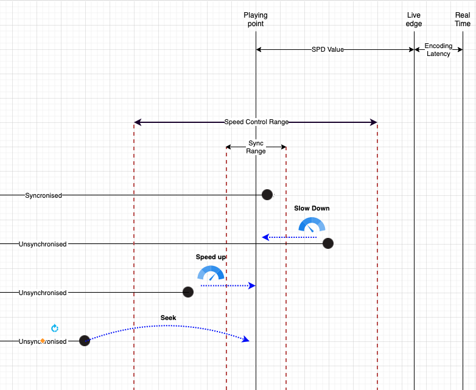

# NexPlayer MultiView

NexPlayer has added a new MultiView feature in Android, iOS & HTML5 Player SDKs that allows broadcasters to display up to 5 simultaneous live streams to viewers with frame-accurate video synchronization within the same player frame (MultiStream Sync).

NexPlayer MultiView provides these brands and broadcasters with an innovative way to broadcast live sporting events giving their viewers the power to choose from multiple angles that are fully synchronized within a seamless playback experience.

## How does it work?

NexPlayer synchronization feature technology allows you to sync the video arrival and stream video synchronously across different devices using the DASH SPD value. 

## What is Suggested Presentation Delay (SPD)?

This is the value where the playback position will be kept and synchronised across different streams and devices compared to the Live edge.

## Server vs Client based synchronization

By default, our solution is depending on the suggestedPresentationDelay value that exists on the DASH manifest. You can control the behaviour by changing this property without needing to update your client applications. 

It is also possible to override that value from the client-side and control it without needing to update your streams. It makes it easier to test and optimise the experience during the development process. Depending on your infrastructure you can choose either option for synchronization

## Limitations

- Synchronization feature is highly dependent on the internet speed and the configuration of the manifest.
- Only works with live content.
- Device time should be adjusted correctly, incorrect device time or setting it manually might break the logic. This can be handled by using server time but the synchronisation won’t be precise as device time as server time is given in seconds, not in milliseconds as device time.
- Setting a very low SPD value for the stream might affect smooth playback experience as it won’t allow the player to create enough buffer.

##### Legal Notices

**Disclaimer for Intellectual Property**

This product is designed for general purposes and accordingly, the customer is responsible for all or any of the intellectual property licenses required for actual application. NexStreaming. does not provide any indemnification for any intellectual properties owned by third parties.

**Copyright**

Copyright for all documents, drawings and programs related to this specification are owned by NexStreaming. All or any part of the specification shall not be reproduced or distributed without prior written approval by NexStreaming. Content and configuration of all or any part of the specification shall not be modified nor distributed without prior written approval by NexStreaming.
